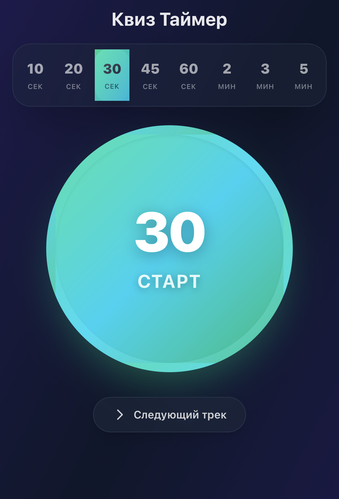

# 🎯 Квиз Таймер

Современный веб-таймер для проведения квизов с встроенным музыкальным плейлистом. Создан для удобного управления временем раундов с телефона.

🔗 **[Открыть приложение](https://quiz-timer.vercel.app/)**



## ✨ Возможности

### ⏱️ Гибкий таймер
- **8 предустановленных интервалов**: 10, 20, 30, 45, 60 секунд, 2, 3 и 5 минут
- Крупная круглая кнопка Старт/Стоп для удобного управления
- Четкое отображение оставшегося времени с автоматическим форматированием
- Кнопка "Стоп" работает как Reset — сбрасывает таймер на выбранное время

### 🎵 Музыкальный плейлист
- Автоматическое воспроизведение музыки при запуске таймера
- Бесконечный плейлист из 6 треков
- Плавные fade in/out эффекты (1 секунда)
- Музыка продолжается с места остановки при снятии с паузы
- Кнопка переключения на следующий трек
- Треки упорядочены так, чтобы избежать повторения похожих песен подряд

### 🎨 Современный дизайн
- Адаптивный интерфейс для мобильных устройств
- Темный градиентный фон (индиго → серый)
- Эффект матового стекла (backdrop blur) для элементов
- Плавные анимации и переходы
- Динамические цвета: зеленый для "Старт", красный для "Стоп"
- Индикатор воспроизведения музыки с пульсирующей точкой

## 🚀 Быстрый старт

### Установка

```bash
# Клонировать репозиторий
git clone git@github.com:phpdude/quiz-timer.git
cd quiz-timer

# Установить зависимости
npm install

# Запустить в режиме разработки
npm run dev
```

Приложение будет доступно по адресу:
- **Локально**: http://localhost:3000
- **По сети** (для доступа с телефона): http://[ваш-ip]:3000

### Продакшн

```bash
# Собрать для продакшна
npm run build

# Запустить продакшн-сервер
npm start
```

## 📱 Использование

1. **Выберите время раунда** в верхней панели (от 10 секунд до 5 минут)
2. **Нажмите на большую круглую кнопку** для запуска таймера
3. Музыка начнет играть автоматически с плавным нарастанием громкости
4. **Нажмите "Стоп"** для остановки и сброса таймера
5. Используйте кнопку **"Следующий трек"** для переключения музыки

## 🛠️ Технологии

- **Next.js 16** — React-фреймворк для веб-приложений
- **React 19** — Библиотека для построения интерфейса
- **TypeScript** — Типизированный JavaScript
- **Tailwind CSS 4** — Utility-first CSS фреймворк
- **HTML5 Audio API** — Для воспроизведения музыки

## 📂 Структура проекта

```
quiz-timer/
├── app/
│   ├── page.tsx          # Главная страница с таймером
│   ├── layout.tsx        # Layout приложения
│   └── globals.css       # Глобальные стили
├── public/
│   └── *.mp3            # Музыкальные треки
├── package.json         # Зависимости проекта
├── tsconfig.json        # Конфигурация TypeScript
├── tailwind.config.js   # Конфигурация Tailwind CSS
└── next.config.js       # Конфигурация Next.js
```

## 🎵 Музыкальный плейлист

Плейлист состоит из 6 треков, упорядоченных для избежания повторения похожих песен:

1. Если мир — это игра, то где кнопка выход
2. Мне врали в школе, врали в новостях
3. Это не музыка
4. Если мир — это игра, то где кнопка выход (версия 2)
5. Я любил тебя так наивно
6. Мне врали в школе, врали в новостях (версия 2)

### Добавление своих треков

1. Поместите MP3 файлы в папку `public/`
2. Отредактируйте массив `MUSIC_FILES` в `app/page.tsx`:

```typescript
const MUSIC_FILES = [
  '/your-track-1.mp3',
  '/your-track-2.mp3',
  // ... добавьте свои треки
]
```

## ⚙️ Настройки

### Изменение интервалов времени

Отредактируйте массив `TIME_OPTIONS` в `app/page.tsx`:

```typescript
const TIME_OPTIONS = [
  { label: '15', value: 15, unit: 'сек' },
  { label: '30', value: 30, unit: 'сек' },
  // ... добавьте свои интервалы
]
```

### Настройка громкости и эффектов

В файле `app/page.tsx` найдите функции `fadeIn` и `fadeOut`:

```typescript
// Изменить целевую громкость (0.0 - 1.0)
const targetVolume = 0.5

// Изменить длительность fade эффектов (в миллисекундах)
fadeIn(audioRef.current, 1000)
fadeOut(audioRef.current, 1000)
```

## 🌐 Деплой

### Vercel (рекомендуется)

Самый простой способ задеплоить Next.js приложение:

```bash
npm install -g vercel
vercel
```

### Docker

```bash
# Собрать образ
docker build -t quiz-timer .

# Запустить контейнер
docker run -p 3000:3000 quiz-timer
```

### Другие платформы

Приложение совместимо с любой платформой, поддерживающей Node.js:
- Netlify
- Railway
- Render
- Heroku

## 🤝 Вклад в проект

Contributions, issues и feature requests приветствуются!

## 📝 Лицензия

ISC

## 👨‍💻 Автор

Создано с помощью Claude Sonnet 4.5

---

**Приятного использования! 🎉**
